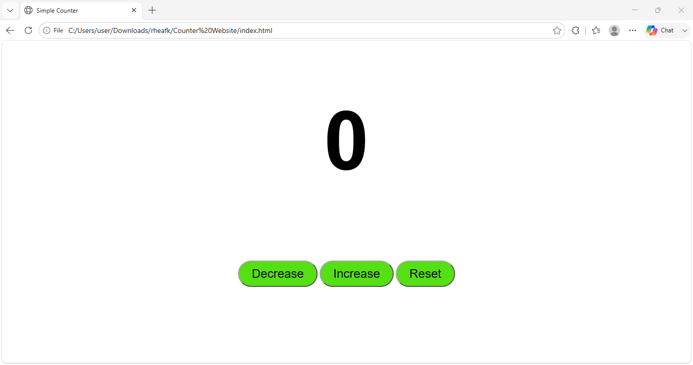

# Counter Website

A simple and interactive counter website built using **HTML, CSS, and JavaScript**.

## 📸 Preview




## ✨ Features

* Increase the counter
* Decrease the counter
* Reset the counter
* Simple and clean interface

## 🛠️ Technologies Used

* **HTML** – Structure
* **CSS** – Styling and layout
* **JavaScript** – Counter functionality and DOM manipulation

## 📂 Project Structure

```text
Counter-website/
├── index.html
├── style.css
├── script.js
└── preview.png
```

## 📚 What I Learned

* How to manipulate HTML elements using JavaScript
* How to create and use JavaScript functions
* How to connect HTML, CSS, and JavaScript
* Basic DOM manipulation

## 🚀 How to Run

1. Clone the repository.
2. Open the project folder.
3. Open `index.html` in your browser.

## 👩‍💻 Author

**Rhea**

[GitHub Profile](https://github.com/codewithrhea)

